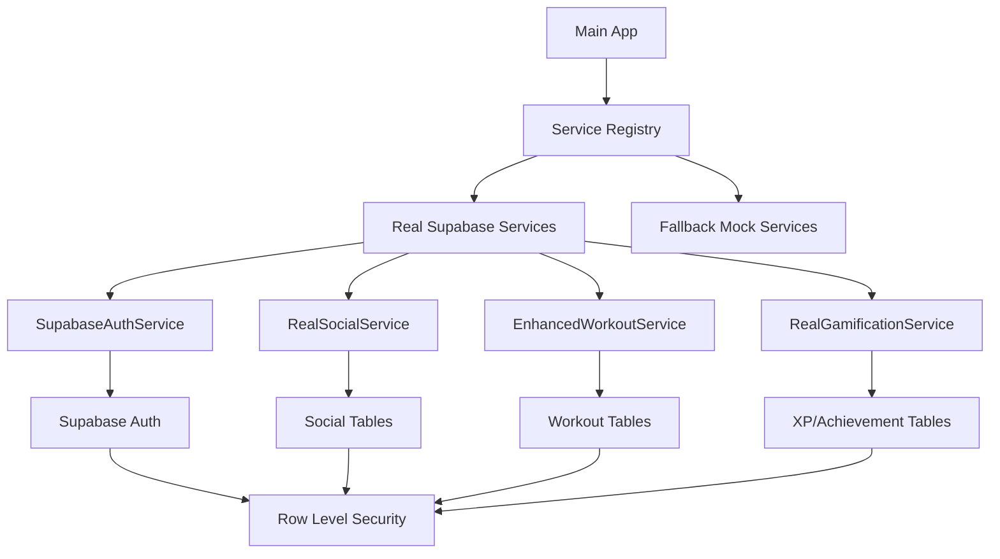

# Design Document - Feature Integration & Wiring

## Overview

Based on the comprehensive analysis of the Sport Tracker app, we have identified that **90% of features are implemented** but many are using mock services or are not properly wired into the main application flow. This design addresses the critical integration gaps, Supabase connection completion, and performance optimization for the free tier.

## Current Implementation Status Analysis

### ✅ **Fully Implemented & Working (90%+)**
- Core authentication system with multiple roles
- Complete UI component library with theming
- Offline-first IndexedDB database layer
- Workout system with templates and basic player
- Mobile-first responsive navigation
- Gamification system (XP, levels, achievements)
- Zustand stores architecture
- Zod validation schemas
- Testing framework setup

### 🔄 **Partially Implemented (50-80%)**
- **Social System**: Basic gym friends, missing real feed integration
- **Streak System**: Basic implementation, missing personalization
- **Challenge System**: Structure exists, missing group functionality
- **Percentile System**: Calculator ready, missing real data integration
- **Notification System**: Basic setup, missing push notifications
- **Marketplace**: UI structure, missing payment integration

### ❌ **Mock Services Needing Supabase Integration**
- **AuthService**: Currently using mock authentication
- **GamificationService**: Using MockGamificationService
- **SocialPostsService**: Mock data, needs real DB connection
- **WorkoutService**: Partially connected, needs optimization
- **StreakService**: Mock data, needs real streak tracking
- **PercentileService**: Mock calculations, needs real user data

## Architecture

### Integration Strategy



### Service Registry Pattern

We'll implement a service registry that can switch between real and mock services based on:
- Environment configuration
- Feature flags
- Connection status
- User role/subscription

## Components and Interfaces

### 1. Service Registry

**Purpose**: Central service locator that manages real vs mock service instances

**Key Features**:
- Environment-based service selection
- Graceful fallback to mock services
- Health check monitoring
- Performance metrics collection

### 2. Enhanced Supabase Service Layer

**Purpose**: Optimized, type-safe Supabase operations with resource management

**Key Features**:
- Batch operations to minimize API calls
- Intelligent caching for free tier optimization
- Rate limiting and request queuing
- Connection pooling and retry logic

### 3. Real-time Integration Manager

**Purpose**: Manages real-time subscriptions without performance degradation

**Key Features**:
- Subscription lifecycle management
- Memory leak prevention
- Selective real-time updates based on user activity
- Offline/online state synchronization

### 4. Navigation Integration

**Purpose**: Wire all implemented features into main app navigation

**Key Features**:
- Dynamic menu generation based on user role
- Feature discovery system
- Progressive disclosure of advanced features
- Mobile-optimized navigation flow

## Data Models

### Service Configuration

```typescript
interface ServiceConfig {
  environment: 'development' | 'staging' | 'production';
  useRealServices: boolean;
  supabaseConfig: {
    url: string;
    anonKey: string;
    maxConnections: number;
    rateLimits: RateLimitConfig;
  };
  fallbackToMock: boolean;
  healthCheckInterval: number;
}

interface RateLimitConfig {
  requestsPerMinute: number;
  burstLimit: number;
  backoffStrategy: 'exponential' | 'linear';
}
```

### Integration Status

```typescript
interface IntegrationStatus {
  service: string;
  status: 'connected' | 'fallback' | 'error';
  lastHealthCheck: Date;
  errorCount: number;
  performance: {
    averageResponseTime: number;
    successRate: number;
    cacheHitRate: number;
  };
}
```

## Error Handling

### Graceful Degradation Strategy

1. **Primary**: Real Supabase services
2. **Fallback**: Mock services with local data
3. **Emergency**: Read-only mode with cached data

### Error Recovery

- Automatic retry with exponential backoff
- Circuit breaker pattern for failing services
- User notification for service degradation
- Offline mode activation when needed

## Testing Strategy

### Integration Testing

1. **Service Registry Tests**
   - Service switching logic
   - Fallback mechanisms
   - Health check accuracy

2. **Supabase Integration Tests**
   - Real database operations
   - Rate limiting compliance
   - Connection management

3. **Performance Tests**
   - API call optimization
   - Memory usage monitoring
   - Real-time subscription management

4. **User Flow Tests**
   - End-to-end feature access
   - Navigation completeness
   - Cross-feature integration

### Testing Environments

- **Unit Tests**: Mock services only
- **Integration Tests**: Real Supabase with test database
- **E2E Tests**: Full production-like environment
- **Performance Tests**: Load testing with free tier limits

## Performance Optimization

### Free Tier Resource Management

#### Database Optimization
- **Batch Operations**: Group multiple operations into single requests
- **Intelligent Caching**: Cache frequently accessed data locally
- **Query Optimization**: Use indexes and efficient query patterns
- **Connection Pooling**: Reuse connections to minimize overhead

#### Real-time Optimization
- **Selective Subscriptions**: Only subscribe to actively viewed data
- **Subscription Batching**: Group related subscriptions
- **Memory Management**: Proper cleanup of subscriptions
- **Throttling**: Limit update frequency for non-critical data

#### API Call Reduction
- **Data Prefetching**: Load related data in single requests
- **Optimistic Updates**: Update UI immediately, sync later
- **Delta Synchronization**: Only sync changed data
- **Background Sync**: Batch non-urgent operations

### Caching Strategy

```typescript
interface CacheStrategy {
  userProfiles: { ttl: 300000, strategy: 'stale-while-revalidate' };
  exercises: { ttl: 3600000, strategy: 'cache-first' };
  workouts: { ttl: 60000, strategy: 'network-first' };
  social: { ttl: 30000, strategy: 'network-only' };
}
```

## Security Considerations

### Row Level Security (RLS)

All Supabase tables must have proper RLS policies:
- Users can only access their own data
- Public data (exercises, achievements) accessible to all
- Social data respects privacy settings
- Admin data restricted to admin users

### Data Validation

- Client-side validation with Zod schemas
- Server-side validation in Supabase functions
- Input sanitization for all user data
- Rate limiting to prevent abuse

## Implementation Phases

### Phase 1: Service Registry & Core Integration (Week 1-2)
- Implement ServiceRegistry pattern
- Create enhanced SupabaseService
- Replace AuthService with real Supabase auth
- Basic health checking and fallback

### Phase 2: Social & Gamification Integration (Week 3-4)
- Replace MockGamificationService with real implementation
- Connect SocialPostsService to Supabase
- Implement real-time social feed
- Add proper XP/achievement tracking

### Phase 3: Workout & Performance Integration (Week 5-6)
- Enhance WorkoutService with batch operations
- Implement real streak tracking
- Connect percentile calculations to real data
- Optimize database queries for performance

### Phase 4: Navigation & Feature Wiring (Week 7-8)
- Wire all features into main navigation
- Implement feature discovery system
- Add progressive disclosure for advanced features
- Complete mobile navigation optimization

### Phase 5: Testing & Optimization (Week 9-10)
- Comprehensive integration testing
- Performance optimization and monitoring
- Error handling and recovery testing
- Production deployment preparation

## Success Metrics

### Technical Metrics
- **API Call Reduction**: 50% fewer calls through batching
- **Response Time**: <200ms average for cached operations
- **Cache Hit Rate**: >80% for frequently accessed data
- **Error Rate**: <1% for all service operations

### User Experience Metrics
- **Feature Discovery**: 90% of users access 3+ major features
- **Navigation Efficiency**: <3 taps to reach any feature
- **Performance**: No degradation in app responsiveness
- **Reliability**: 99.9% uptime for core functionality

### Resource Efficiency
- **Database Connections**: Stay within free tier limits
- **Real-time Subscriptions**: <10 concurrent per user
- **Storage Usage**: Efficient caching without bloat
- **Network Usage**: Optimized for mobile data plans

## Risk Mitigation

### Technical Risks
- **Supabase Rate Limits**: Implement intelligent batching and caching
- **Real-time Performance**: Selective subscriptions and proper cleanup
- **Data Migration**: Gradual rollout with fallback options
- **Service Dependencies**: Circuit breaker pattern for resilience

### User Experience Risks
- **Feature Discoverability**: Progressive onboarding and hints
- **Performance Degradation**: Continuous monitoring and optimization
- **Data Loss**: Robust offline/online synchronization
- **Service Interruption**: Graceful degradation to offline mode

This design ensures that all implemented features are properly integrated, optimized for the Supabase free tier, and provide a seamless user experience while maintaining high performance and reliability.