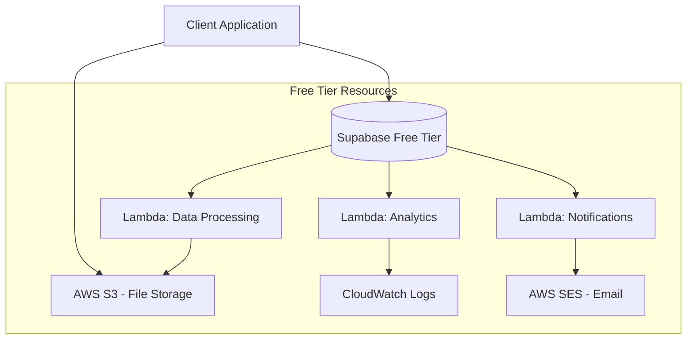
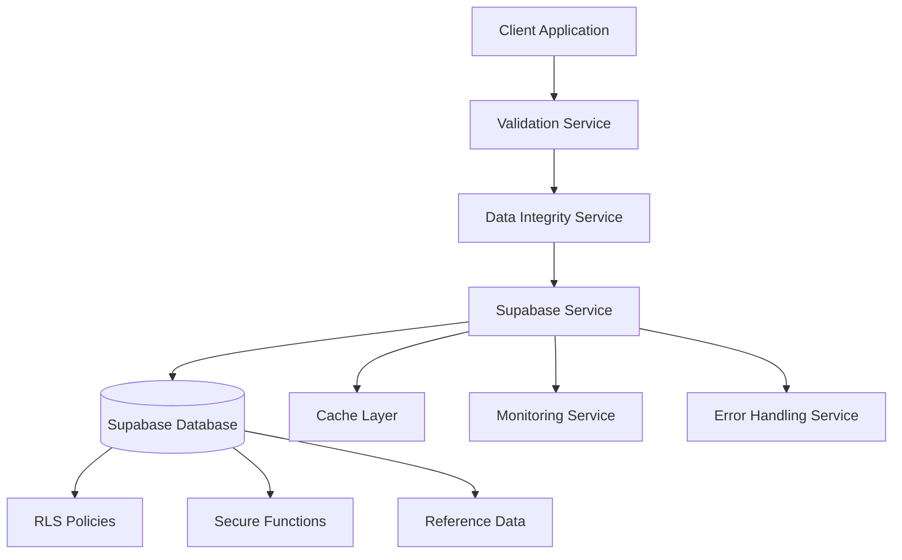

# Design Document

## Overview

This design addresses the critical security vulnerabilities and missing components in the Supabase integration through a systematic approach that prioritizes security hardening, implements missing services, and ensures data integrity. The solution maintains backward compatibility while significantly improving security posture and system reliability.

## Architecture

### Security-First, Performance-Optimized Approach

The design follows a defense-in-depth strategy optimized for Supabase free tier limitations (500MB database, 2GB bandwidth, 50,000 monthly active users) with AWS Lambda integration for heavy operations:

1. **Database Layer**: RLS policies, optimized queries, connection limits
2. **Service Layer**: Input validation, aggressive caching, rate limiting
3. **Application Layer**: Error handling, offline-first, graceful degradation
4. **Infrastructure Layer**: AWS Lambda for background tasks, S3 for file storage
5. **Performance Layer**: Query optimization, connection pooling, CDN integration

### AWS Integration Strategy



### Component Interaction Flow



## Components and Interfaces

### 1. Database Security Layer

#### RLS Policy Framework
```typescript
interface RLSPolicyConfig {
  tableName: string;
  policyName: string;
  operation: 'SELECT' | 'INSERT' | 'UPDATE' | 'DELETE';
  condition: string;
  roles: string[];
}

interface SecurityPolicyManager {
  enableRLS(tableName: string): Promise<void>;
  createUserPolicy(config: RLSPolicyConfig): Promise<void>;
  createAdminPolicy(config: RLSPolicyConfig): Promise<void>;
  validatePolicies(): Promise<SecurityAuditResult>;
}
```

#### Secure Function Framework
```typescript
interface SecureFunctionConfig {
  functionName: string;
  searchPath: string;
  securityDefiner: boolean;
  grantTo: string[];
}

interface DatabaseFunctionManager {
  createSecureFunction(config: SecureFunctionConfig, sql: string): Promise<void>;
  updateFunctionSecurity(functionName: string): Promise<void>;
  auditFunctionSecurity(): Promise<FunctionSecurityReport>;
}
```

### 2. Validation Service

#### Core Validation Interface
```typescript
interface ValidationService {
  validateUserProfile(data: unknown): UserProfileData;
  validateWorkout(data: unknown): WorkoutData;
  validateSocialPost(data: unknown): SocialPostData;
  validateExercise(data: unknown): ExerciseData;
  checkRateLimit(userId: string, operation: string, limit: number, window: number): void;
  validateOwnership(resourceUserId: string, requestUserId: string): void;
  sanitizeInput(input: string): string;
}
```

#### Zod Schema Architecture
```typescript
// Base schemas with reusable patterns
const BaseUserSchema = z.object({
  id: z.string().uuid(),
  email: z.string().email(),
  username: z.string().regex(/^[a-zA-Z0-9_]{3,50}$/),
  created_at: z.string().datetime(),
  updated_at: z.string().datetime()
});

// Extensible validation with context
interface ValidationContext {
  userId?: string;
  userRole?: UserRole;
  operation: 'create' | 'update' | 'delete';
  skipOwnershipCheck?: boolean;
}
```

### 3. Data Integrity Service

#### Integrity Management Interface
```typescript
interface DataIntegrityService {
  // Transaction management
  executeInTransaction<T>(operation: () => Promise<T>): Promise<T>;
  
  // Consistency checks
  validateXPConsistency(userId: string): Promise<IntegrityReport>;
  validateStreakConsistency(userId: string): Promise<IntegrityReport>;
  validateSocialCountConsistency(postId: string): Promise<IntegrityReport>;
  
  // Repair mechanisms
  repairXPInconsistency(userId: string): Promise<RepairResult>;
  repairStreakInconsistency(userId: string): Promise<RepairResult>;
  repairSocialCounts(postId: string): Promise<RepairResult>;
  
  // Conflict resolution
  resolveConflict(conflict: DataConflict): Promise<ConflictResolution>;
}
```

#### Consistency Patterns
```typescript
interface ConsistencyCheck {
  name: string;
  description: string;
  check: (context: any) => Promise<boolean>;
  repair: (context: any) => Promise<void>;
  severity: 'low' | 'medium' | 'high' | 'critical';
}

interface IntegrityMonitor {
  scheduleConsistencyChecks(): void;
  runConsistencyCheck(checkName: string): Promise<IntegrityReport>;
  getIntegrityStatus(): Promise<SystemIntegrityStatus>;
}
```

### 4. Enhanced Service Layer

#### Service Registry Pattern
```typescript
interface ServiceRegistry {
  register<T>(name: string, service: T): void;
  get<T>(name: string): T;
  health(): Promise<ServiceHealthReport>;
  shutdown(): Promise<void>;
}

interface ServiceHealth {
  name: string;
  status: 'healthy' | 'degraded' | 'unhealthy';
  lastCheck: Date;
  metrics: ServiceMetrics;
}
```

#### Enhanced Error Handling
```typescript
interface ErrorHandlingService {
  handleDatabaseError(error: PostgrestError, context: ErrorContext): AppError;
  handleValidationError(error: ZodError, context: ErrorContext): AppError;
  handleRateLimitError(userId: string, operation: string): AppError;
  handleAuthError(error: AuthError): AppError;
  
  // Recovery mechanisms
  attemptRecovery(error: AppError): Promise<RecoveryResult>;
  escalateError(error: AppError): Promise<void>;
}
```

### 5. Reference Data Management

#### Data Population Framework
```typescript
interface ReferenceDataManager {
  // Population methods
  populateExerciseCategories(): Promise<void>;
  populateMuscleGroups(): Promise<void>;
  populateEquipmentTypes(): Promise<void>;
  populateAchievements(): Promise<void>;
  
  // Validation methods
  validateReferenceData(): Promise<ValidationReport>;
  
  // Migration methods
  createMigration(name: string, data: any[]): Promise<string>;
  runMigration(migrationId: string): Promise<MigrationResult>;
}
```

## Data Models

### Enhanced Security Models

#### RLS Policy Configuration
```typescript
interface RLSPolicy {
  id: string;
  table_name: string;
  policy_name: string;
  policy_type: 'permissive' | 'restrictive';
  command: 'SELECT' | 'INSERT' | 'UPDATE' | 'DELETE' | 'ALL';
  roles: string[];
  using_expression: string;
  check_expression?: string;
  created_at: Date;
  is_active: boolean;
}
```

#### Validation Schema Registry
```typescript
interface ValidationSchema {
  id: string;
  name: string;
  version: string;
  schema_definition: ZodSchema;
  context_requirements: string[];
  created_at: Date;
  is_active: boolean;
}
```

#### Data Integrity Models
```typescript
interface IntegrityCheck {
  id: string;
  name: string;
  description: string;
  check_type: 'consistency' | 'referential' | 'business_rule';
  target_tables: string[];
  check_query: string;
  repair_query?: string;
  severity: 'low' | 'medium' | 'high' | 'critical';
  schedule: string; // cron expression
  last_run: Date;
  last_result: 'pass' | 'fail' | 'error';
}

interface DataConflict {
  id: string;
  table_name: string;
  record_id: string;
  conflict_type: 'version' | 'constraint' | 'business_rule';
  local_data: Record<string, any>;
  remote_data: Record<string, any>;
  resolution_strategy: 'manual' | 'local_wins' | 'remote_wins' | 'merge';
  created_at: Date;
  resolved_at?: Date;
}
```

### Reference Data Models

#### Exercise System Enhancement
```typescript
interface ExerciseCategory {
  id: string;
  name: string;
  name_es: string;
  description?: string;
  icon?: string;
  color?: string;
  sort_order: number;
  is_active: boolean;
}

interface MuscleGroup {
  id: string;
  name: string;
  name_es: string;
  body_part: 'upper' | 'lower' | 'core' | 'full_body';
  description?: string;
  anatomical_region: string;
  is_primary_mover: boolean;
}

interface EquipmentType {
  id: string;
  name: string;
  name_es: string;
  description?: string;
  icon?: string;
  category: 'free_weights' | 'machines' | 'cardio' | 'bodyweight' | 'accessories';
  availability_score: number; // 1-10, how common this equipment is
}
```

## Error Handling

### Error Classification System

#### Error Hierarchy
```typescript
abstract class AppError extends Error {
  abstract readonly code: string;
  abstract readonly severity: 'low' | 'medium' | 'high' | 'critical';
  abstract readonly recoverable: boolean;
  
  constructor(
    message: string,
    public readonly context?: Record<string, any>,
    public readonly cause?: Error
  ) {
    super(message);
  }
}

class ValidationError extends AppError {
  readonly code = 'VALIDATION_ERROR';
  readonly severity = 'medium';
  readonly recoverable = true;
}

class SecurityError extends AppError {
  readonly code = 'SECURITY_ERROR';
  readonly severity = 'critical';
  readonly recoverable = false;
}

class DataIntegrityError extends AppError {
  readonly code = 'DATA_INTEGRITY_ERROR';
  readonly severity = 'high';
  readonly recoverable = true;
}
```

#### Error Recovery Strategies
```typescript
interface ErrorRecoveryStrategy {
  canRecover(error: AppError): boolean;
  recover(error: AppError): Promise<RecoveryResult>;
  getRetryDelay(attempt: number): number;
  getMaxRetries(): number;
}

class DatabaseErrorRecovery implements ErrorRecoveryStrategy {
  canRecover(error: AppError): boolean {
    return error instanceof DatabaseError && 
           !error.message.includes('constraint violation');
  }
  
  async recover(error: AppError): Promise<RecoveryResult> {
    // Implement connection retry, transaction rollback, etc.
  }
}
```

### Graceful Degradation Framework

#### Service Degradation Levels
```typescript
enum DegradationLevel {
  FULL_SERVICE = 0,
  REDUCED_FEATURES = 1,
  CORE_ONLY = 2,
  READ_ONLY = 3,
  OFFLINE = 4
}

interface DegradationStrategy {
  level: DegradationLevel;
  disabledFeatures: string[];
  fallbackBehaviors: Record<string, () => any>;
  userMessage: string;
}
```

## Testing Strategy

### Security Testing Framework

#### RLS Policy Testing
```typescript
interface RLSTestCase {
  description: string;
  table: string;
  operation: 'SELECT' | 'INSERT' | 'UPDATE' | 'DELETE';
  userContext: {
    userId: string;
    role: string;
    additionalClaims?: Record<string, any>;
  };
  testData: Record<string, any>;
  expectedResult: 'allow' | 'deny';
  expectedRowCount?: number;
}

interface SecurityTestSuite {
  runRLSTests(testCases: RLSTestCase[]): Promise<TestResult[]>;
  testFunctionSecurity(functionName: string): Promise<SecurityTestResult>;
  testInputValidation(endpoint: string, payloads: any[]): Promise<ValidationTestResult[]>;
}
```

#### Integration Testing Strategy
```typescript
interface IntegrationTestScenario {
  name: string;
  description: string;
  setup: () => Promise<void>;
  execute: () => Promise<any>;
  verify: (result: any) => Promise<boolean>;
  cleanup: () => Promise<void>;
}

interface EndToEndTestSuite {
  testUserRegistrationFlow(): Promise<TestResult>;
  testWorkoutCreationFlow(): Promise<TestResult>;
  testSocialInteractionFlow(): Promise<TestResult>;
  testDataConsistencyFlow(): Promise<TestResult>;
}
```

### Performance Testing Framework

#### Load Testing Configuration
```typescript
interface LoadTestConfig {
  scenario: string;
  concurrentUsers: number;
  duration: string;
  rampUpTime: string;
  endpoints: LoadTestEndpoint[];
  acceptanceCriteria: {
    maxResponseTime: number;
    maxErrorRate: number;
    minThroughput: number;
  };
}

interface PerformanceMonitor {
  startLoadTest(config: LoadTestConfig): Promise<LoadTestResult>;
  monitorRealTimeMetrics(): Promise<PerformanceMetrics>;
  generatePerformanceReport(): Promise<PerformanceReport>;
}
```

### AWS Lambda Integration Points

#### Background Processing Lambda Functions
```typescript
interface LambdaFunction {
  name: string;
  runtime: 'nodejs18.x';
  memorySize: 128 | 256 | 512; // Optimize for free tier
  timeout: number; // Max 15 minutes
  triggers: LambdaTrigger[];
}

// Heavy operations moved to Lambda
const lambdaFunctions = {
  dataProcessing: {
    name: 'sport-tracker-data-processor',
    purpose: 'Process workout analytics, percentile calculations',
    memorySize: 512,
    timeout: 300 // 5 minutes
  },
  notifications: {
    name: 'sport-tracker-notifications',
    purpose: 'Send email notifications, push notifications',
    memorySize: 256,
    timeout: 60
  },
  fileProcessing: {
    name: 'sport-tracker-file-processor',
    purpose: 'Image resizing, video processing for exercise media',
    memorySize: 512,
    timeout: 300
  },
  analytics: {
    name: 'sport-tracker-analytics',
    purpose: 'Generate reports, calculate statistics',
    memorySize: 256,
    timeout: 180
  }
};
```

#### AWS Free Tier Resources Available
- **Lambda**: 1M free requests/month, 400,000 GB-seconds compute time
- **S3**: 5GB storage, 20,000 GET requests, 2,000 PUT requests
- **CloudWatch**: 10 custom metrics, 1M API requests
- **SES**: 200 emails/day (when sending from EC2)
- **API Gateway**: 1M API calls/month
- **DynamoDB**: 25GB storage, 25 read/write capacity units

### Performance Optimization Strategy

#### Connection Management for Free Tier
```typescript
interface ConnectionPoolConfig {
  maxConnections: 10; // Supabase free tier limit ~20
  idleTimeout: 30000; // 30 seconds
  connectionTimeout: 5000; // 5 seconds
  retryAttempts: 3;
  backoffMultiplier: 2;
}

interface QueryOptimization {
  enableQueryCache: true;
  cacheSize: '50MB'; // Conservative for free tier
  cacheTTL: 300; // 5 minutes default
  batchSize: 100; // Limit batch operations
  enableCompression: true;
}
```

#### Aggressive Caching Strategy
```typescript
interface CachingStrategy {
  // Client-side caching
  localStorage: {
    userProfile: '24h',
    exercises: '7d',
    categories: '30d'
  };
  
  // Service worker caching
  serviceWorker: {
    staticAssets: 'cache-first',
    apiResponses: 'network-first-with-fallback',
    images: 'cache-first-with-update'
  };
  
  // Application-level caching
  memory: {
    maxSize: '10MB',
    ttl: '5m',
    evictionPolicy: 'LRU'
  };
}
```

## Implementation Phases

### Phase 1: Critical Security & Performance (Week 1) - PRIORITY
1. **Security Hardening**
   - Enable RLS on all tables with optimized policies
   - Fix security definer views
   - Implement rate limiting to protect free tier limits
   
2. **Performance Optimization**
   - Implement connection pooling with strict limits
   - Add query optimization and indexing
   - Set up aggressive caching strategy

### Phase 2: AWS Integration & Core Services (Week 2)
1. **AWS Lambda Setup**
   - Deploy data processing Lambda for heavy operations
   - Set up S3 for file storage (exercise images, user avatars)
   - Configure CloudWatch for monitoring
   
2. **Service Implementation**
   - ValidationService with performance-optimized Zod schemas
   - DataIntegrityService with Lambda-based consistency checks
   - Enhanced error handling with circuit breakers

### Phase 3: Reference Data & Monitoring (Week 3)
1. **Data Population via Lambda**
   - Lambda function to populate reference data from S3
   - Batch processing to avoid connection limits
   - Monitoring and alerting setup
   
2. **Performance Monitoring**
   - CloudWatch metrics integration
   - Query performance tracking
   - Free tier usage monitoring

### Phase 4: Advanced Features & Optimization (Week 4)
1. **Advanced AWS Integration**
   - SES for email notifications
   - API Gateway for webhook endpoints
   - DynamoDB for session storage (if needed)
   
2. **Production Readiness**
   - Load testing within free tier limits
   - Disaster recovery procedures
   - Documentation and monitoring dashboards

### Free Tier Monitoring & Alerts
```typescript
interface FreeTierMonitoring {
  supabase: {
    databaseSize: { limit: '500MB', alertAt: '400MB' },
    bandwidth: { limit: '2GB/month', alertAt: '1.6GB' },
    activeUsers: { limit: '50K/month', alertAt: '40K' }
  },
  aws: {
    lambdaInvocations: { limit: '1M/month', alertAt: '800K' },
    s3Storage: { limit: '5GB', alertAt: '4GB' },
    s3Requests: { limit: '20K GET/month', alertAt: '16K' }
  }
}
```

This design prioritizes security while optimizing for free tier constraints and leveraging AWS Lambda for heavy operations that would otherwise strain Supabase resources.