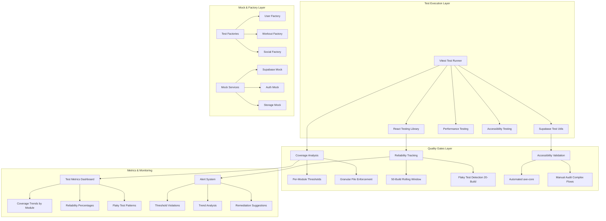

# Test Quality Improvement - Design Document

## Overview

This design document outlines the technical architecture and implementation strategy for transforming the Sport Tracker PWA's test suite from 75% reliability (286 failing tests) to 99%+ reliability measured over a rolling 50-build window with granular per-module coverage enforcement (90% overall, no file below 80%, components minimum 75%, utilities minimum 85%). The design focuses on systematic test infrastructure improvements, comprehensive test coverage, and automated quality gates with precise metrics tracking.

## Architecture

### Test Infrastructure Architecture



## Design Principles

### 1. Granular Coverage Enforcement
- **Per-Module Thresholds**: Different coverage requirements based on code criticality
- **File-Level Enforcement**: No individual file can drop below its threshold
- **Component-Specific**: UI components have tailored coverage requirements (75% minimum)
- **Utility-Focused**: Business logic utilities require higher coverage (85% minimum)

### 2. Precise Reliability Measurement
- **Rolling Window Analysis**: 50-build window for reliability trends
- **Flaky Test Detection**: 20-build window for inconsistency patterns
- **Statistical Accuracy**: Meaningful sample sizes for reliable metrics
- **Trend-Based Alerts**: Proactive notification before critical thresholds

### 3. Hybrid Accessibility Testing
- **Automated Foundation**: axe-core for basic WCAG 2.1 AA compliance
- **Manual Validation**: Complex interactive flows and keyboard navigation
- **Comprehensive Coverage**: 80% automated, 20% manual for complete validation

## Technical Implementation

### Test Infrastructure Components

#### 1. Enhanced Test Runner Configuration
```typescript
// vitest.config.ts
export default defineConfig({
  test: {
    coverage: {
      provider: 'v8',
      reporter: ['text', 'json', 'html'],
      thresholds: {
        global: {
          branches: 90,
          functions: 90,
          lines: 90,
          statements: 90
        },
        perFile: {
          branches: 80,
          functions: 80,
          lines: 80,
          statements: 80
        }
      },
      // Per-module enforcement
      watermarks: {
        statements: [75, 85], // Component vs Utility thresholds
        functions: [75, 85],
        branches: [75, 85],
        lines: [75, 85]
      }
    },
    // Reliability tracking
    retry: 0, // No retries to detect flaky tests
    timeout: 10000,
    testTimeout: 5000
  }
})
```

#### 2. Reliability Tracking System
```typescript
// src/test/reliability-tracker.ts
interface TestRun {
  testName: string;
  status: 'pass' | 'fail' | 'skip';
  duration: number;
  buildNumber: number;
  timestamp: Date;
}

class ReliabilityTracker {
  private readonly RELIABILITY_WINDOW = 50; // builds
  private readonly FLAKY_DETECTION_WINDOW = 20; // builds
  
  calculateReliability(testRuns: TestRun[]): number {
    const recentRuns = this.getRecentRuns(testRuns, this.RELIABILITY_WINDOW);
    const successfulRuns = recentRuns.filter(run => run.status === 'pass').length;
    return (successfulRuns / recentRuns.length) * 100;
  }
  
  detectFlakyTests(testRuns: TestRun[]): string[] {
    const recentRuns = this.getRecentRuns(testRuns, this.FLAKY_DETECTION_WINDOW);
    const testGroups = this.groupByTestName(recentRuns);
    
    return Object.entries(testGroups)
      .filter(([_, runs]) => this.isFlaky(runs))
      .map(([testName, _]) => testName);
  }
  
  private isFlaky(runs: TestRun[]): boolean {
    const hasFailures = runs.some(run => run.status === 'fail');
    const hasSuccesses = runs.some(run => run.status === 'pass');
    const failureRate = runs.filter(run => run.status === 'fail').length / runs.length;
    
    return hasFailures && hasSuccesses && failureRate > 0.01; // >1% failure rate
  }
}
```

#### 3. Per-Module Coverage Enforcement
```typescript
// src/test/coverage-enforcer.ts
interface ModuleCoverageConfig {
  pattern: string;
  minCoverage: number;
  type: 'component' | 'utility' | 'service' | 'page';
}

const COVERAGE_RULES: ModuleCoverageConfig[] = [
  { pattern: 'src/components/**/*.tsx', minCoverage: 75, type: 'component' },
  { pattern: 'src/utils/**/*.ts', minCoverage: 85, type: 'utility' },
  { pattern: 'src/services/**/*.ts', minCoverage: 85, type: 'service' },
  { pattern: 'src/pages/**/*.tsx', minCoverage: 80, type: 'page' }
];

class CoverageEnforcer {
  validateCoverage(coverageReport: CoverageReport): ValidationResult {
    const violations: CoverageViolation[] = [];
    
    for (const rule of COVERAGE_RULES) {
      const matchingFiles = this.getMatchingFiles(coverageReport, rule.pattern);
      
      for (const file of matchingFiles) {
        if (file.coverage < rule.minCoverage) {
          violations.push({
            file: file.path,
            expected: rule.minCoverage,
            actual: file.coverage,
            type: rule.type
          });
        }
      }
    }
    
    return {
      passed: violations.length === 0,
      violations,
      overallCoverage: this.calculateOverallCoverage(coverageReport)
    };
  }
}
```

#### 4. Accessibility Testing Framework
```typescript
// src/test/accessibility-tester.ts
import { axe, toHaveNoViolations } from 'jest-axe';

class AccessibilityTester {
  async runAutomatedChecks(component: RenderResult): Promise<AxeResults> {
    const results = await axe(component.container, {
      rules: {
        // WCAG 2.1 AA rules
        'color-contrast': { enabled: true },
        'keyboard-navigation': { enabled: true },
        'focus-management': { enabled: true },
        'aria-labels': { enabled: true }
      }
    });
    
    expect(results).toHaveNoViolations();
    return results;
  }
  
  // Manual test checklist for complex flows
  getManualTestChecklist(): ManualAccessibilityTest[] {
    return [
      {
        name: 'Keyboard Navigation - Workout Player',
        description: 'Verify all workout controls accessible via keyboard',
        steps: [
          'Tab through all controls',
          'Verify focus indicators',
          'Test space/enter activation',
          'Verify escape key behavior'
        ]
      },
      {
        name: 'Screen Reader - Social Feed',
        description: 'Verify social feed announcements',
        steps: [
          'Test with NVDA/JAWS',
          'Verify post announcements',
          'Test live region updates',
          'Verify semantic structure'
        ]
      }
    ];
  }
}
```

### Quality Gates Implementation

#### 1. CI/CD Pipeline Integration
```yaml
# .github/workflows/test-quality-gates.yml
name: Test Quality Gates

on: [push, pull_request]

jobs:
  test-quality:
    runs-on: ubuntu-latest
    steps:
      - uses: actions/checkout@v3
      
      - name: Run Tests with Coverage
        run: |
          npm run test:coverage
          npm run test:reliability-check
          npm run test:accessibility
      
      - name: Enforce Coverage Thresholds
        run: |
          npm run coverage:enforce-per-module
          npm run coverage:validate-overall
      
      - name: Check Test Reliability
        run: |
          npm run reliability:check-flaky-tests
          npm run reliability:validate-trends
      
      - name: Accessibility Validation
        run: |
          npm run a11y:automated-checks
          npm run a11y:generate-manual-checklist
      
      - name: Quality Gate Decision
        run: |
          npm run quality-gate:evaluate
          # Fails build if any threshold violated
```

#### 2. Metrics Dashboard Configuration
```typescript
// src/test/metrics-dashboard.ts
interface TestMetrics {
  coverage: {
    overall: number;
    perModule: Record<string, number>;
    violations: CoverageViolation[];
  };
  reliability: {
    current: number;
    trend: number[];
    flakyTests: string[];
  };
  accessibility: {
    automatedScore: number;
    manualTestsRequired: number;
    violations: A11yViolation[];
  };
}

class MetricsDashboard {
  generateReport(metrics: TestMetrics): DashboardReport {
    return {
      summary: this.createSummary(metrics),
      trends: this.analyzeTrends(metrics),
      alerts: this.generateAlerts(metrics),
      recommendations: this.getRecommendations(metrics)
    };
  }
  
  private generateAlerts(metrics: TestMetrics): Alert[] {
    const alerts: Alert[] = [];
    
    // Coverage alerts
    if (metrics.coverage.overall < 90) {
      alerts.push({
        type: 'coverage',
        severity: 'high',
        message: `Overall coverage ${metrics.coverage.overall}% below 90% threshold`,
        remediation: 'Add tests for uncovered code paths'
      });
    }
    
    // Reliability alerts
    if (metrics.reliability.current < 99) {
      alerts.push({
        type: 'reliability',
        severity: 'critical',
        message: `Test reliability ${metrics.reliability.current}% below 99% threshold`,
        remediation: 'Fix flaky tests and improve test stability'
      });
    }
    
    // Flaky test alerts
    if (metrics.reliability.flakyTests.length > 0) {
      alerts.push({
        type: 'flaky-tests',
        severity: 'medium',
        message: `${metrics.reliability.flakyTests.length} flaky tests detected`,
        remediation: `Fix tests: ${metrics.reliability.flakyTests.join(', ')}`
      });
    }
    
    return alerts;
  }
}
```

## Implementation Phases

### Phase 1: Infrastructure & Critical Fixes (Week 1)
**Goal**: Establish reliable test infrastructure and fix critical failing tests

#### Tasks:
1. **Test Infrastructure Setup**
   - Configure enhanced Vitest with per-module thresholds
   - Implement reliability tracking system
   - Set up coverage enforcement pipeline

2. **Critical Test Fixes**
   - Security middleware tests (12 failing)
   - Calculation logic tests (6 failing)
   - Validation tests (4 failing)

3. **Quality Gates Implementation**
   - CI/CD pipeline integration
   - Automated threshold enforcement
   - Alert system configuration

#### Success Criteria:
- Test reliability > 95% (from 75%)
- Critical security tests passing
- Infrastructure supports granular metrics

### Phase 2: Component & UI Testing (Week 2)
**Goal**: Achieve comprehensive component test coverage with accessibility validation

#### Tasks:
1. **Component Test Enhancement**
   - Fix Button component tests (5 failing)
   - Fix Challenge component tests (13 failing)
   - Implement accessibility testing framework

2. **UI Test Reliability**
   - Standardize component test patterns
   - Implement proper mocking strategies
   - Add accessibility automated checks

3. **Coverage Enforcement**
   - Implement per-module coverage rules
   - Add component-specific thresholds (75% minimum)
   - Set up coverage trend monitoring

#### Success Criteria:
- Component coverage > 75% per file
- All UI tests passing consistently
- Accessibility automated checks integrated

### Phase 3: Integration & Performance (Week 3)
**Goal**: Complete integration test coverage and performance validation

#### Tasks:
1. **Integration Test Completion**
   - Fix offline utility tests (10 failing)
   - Fix sync integration tests (5 failing)
   - Complete end-to-end test scenarios

2. **Performance Testing**
   - Implement performance test framework
   - Add memory leak detection
   - Set up performance regression alerts

3. **Final Quality Validation**
   - Achieve 99%+ reliability target
   - Complete manual accessibility audits
   - Validate all quality gates

#### Success Criteria:
- Overall test reliability > 99%
- All integration tests passing
- Performance benchmarks established

## Monitoring & Maintenance

### Continuous Monitoring
- **Daily**: Reliability metrics tracking over rolling 50-build window
- **Weekly**: Coverage trend analysis and threshold adjustments
- **Monthly**: Flaky test pattern analysis and infrastructure optimization

### Quality Assurance
- **Automated**: Per-commit coverage and reliability validation
- **Manual**: Monthly accessibility audit for complex flows
- **Performance**: Weekly performance regression testing

### Maintenance Procedures
- **Flaky Test Response**: 48-hour SLA for flaky test fixes
- **Coverage Violations**: Immediate build blocking for threshold violations
- **Accessibility Issues**: Prioritized fixing based on WCAG severity levels

This design provides a comprehensive, measurable approach to achieving 99%+ test reliability with granular coverage enforcement and precise metrics tracking.
```
